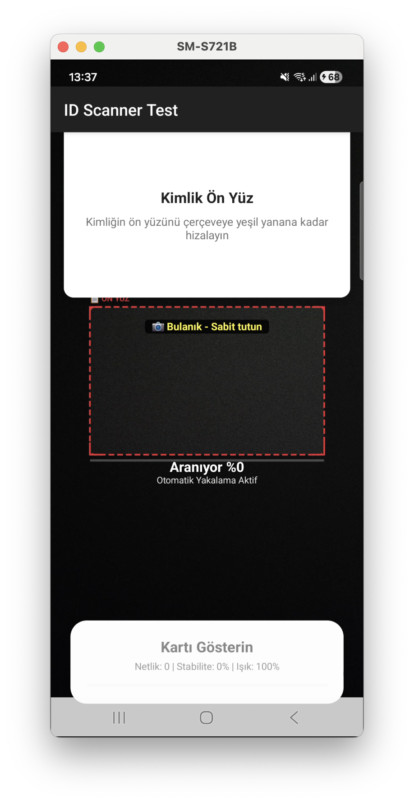

# ID Verify SDK

**Turkish ID Card Scanner SDK** — Open-source, multi-layer architecture for scanning and validating Turkish ID cards in real time.

[](https://opensource.org/licenses/MIT) [](https://github.com/yekkaplan/tcidverify)

## 📖 Overview

This SDK provides:

1. **Android Native SDK** (Kotlin + C++/OpenCV) — Core scanning engine with ML Kit and native image processing
2. **React Native Bridge** — Native module for JavaScript
3. **React Native Library** — TypeScript/JavaScript API

All processing is **offline** and **on-device**; no images or personal data are sent to any server.

## 🏗️ Project Structure

```
idverify/
├── idverify-sdk/
│   ├── android/                    # Native Android SDK (Kotlin + C++)
│   │   ├── src/main/java/com/idverify/sdk/
│   │   │   ├── api/               # Public SDK API
│   │   │   ├── core/              # Verification engine
│   │   │   ├── autocapture/       # Auto-capture & MRZ analysis
│   │   │   ├── mrz/               # MRZ extraction & validation
│   │   │   └── ...
│   │   ├── src/main/cpp/          # OpenCV image processing
│   │   └── build.gradle.kts
│   │
│   └── react-native/              # React Native Library
│       ├── android/               # RN Native Bridge
│       ├── src/                   # TypeScript/JavaScript
│       ├── package.json
│       └── README.md              # RN usage guide
│
├── LICENSE
├── CONTRIBUTING.md
└── README.md
```

## ✨ Features

- ✅ Real-time ID card detection (CameraX + ML Kit)
- ✅ MRZ parsing (ICAO Doc 9303, TD1 format)
- ✅ Native C++ preprocessing (OpenCV) for better OCR
- ✅ ROI + Full-frame fallback for reliable reads
- ✅ Checksum-based auto-correction of OCR errors
- ✅ Dual-side scanning (front & back)
- ✅ TypeScript support for React Native
- ✅ 100% offline; no data stored permanently

## 📱 Screenshots (Android Test App)

| Başlangıç ekranı | Kamera ekranı (ön yüz okuma) |
|------------------|------------------------------|
|  |  |
| T.C. Kimlik Kartı Okuyucu — İşleme Başla | Kimlik ön yüzü çerçeveye hizalayın; netlik ve stabilite geri bildirimi |

## 🚀 Quick Start

### React Native

```bash
# From repository
git clone https://github.com/yekkaplan/tcidverify.git
cd tcidverify
npm install file:./idverify-sdk/react-native

# Or from npm when published
# npm install @idverify/react-native-sdk
```

See [React Native README](idverify-sdk/react-native/README.md) for usage.

### Android (Gradle)

```kotlin
// settings.gradle.kts
include(":idverify-sdk:android")

// app/build.gradle.kts
dependencies {
    implementation(project(":idverify-sdk:android"))
}
```

## 📚 Documentation

| Document | Description |
|----------|-------------|
| [SDK Architecture](idverify-sdk/ARCHITECTURE.md) | Pipeline, modules, and design (Turkish) |
| [SDK README](idverify-sdk/README.md) | Technical overview and integration |
| [React Native](idverify-sdk/react-native/README.md) | RN installation and API |
| [TC ID Spec](idverify-sdk/TC_ID_SPEC.md) | Turkish ID (TD1) format and validation (Turkish) |

## 🔧 Development

```bash
# Build Android SDK
./gradlew :idverify-sdk:android:build

# Build & install Android test app (emulator or device)
./gradlew :idverify-sdk:android-test-app:installDebug

# Build React Native bridge
./gradlew :idverify-sdk:react-native:android:build

# React Native package
cd idverify-sdk/react-native && npm install && npm run prepare
```

**Android test app:** Android Studio’da run konfigürasyonu olarak `idverify-sdk.android-test-app` seçip çalıştırabilirsiniz. Detaylı adımlar için [android-test-app README](idverify-sdk/android-test-app/README.md).

## 📋 Requirements

- **Android**: minSdk 21+ (Android 5.0+)
- **React Native**: 0.71+
- **Kotlin**: 1.9+
- **Java**: 11+

## 🔐 Permissions

```xml
<uses-permission android:name="android.permission.CAMERA" />
<uses-feature android:name="android.hardware.camera" />
```

## 📄 License

This project is open source under the [MIT License](LICENSE).

## 👥 Contributing

Contributions are welcome. Please read [CONTRIBUTING.md](CONTRIBUTING.md) and our [Code of Conduct](CODE_OF_CONDUCT.md) before submitting issues or pull requests.

## 🐛 Issues & Discussions

[Open an issue](https://github.com/yekkaplan/tcidverify/issues) or start a discussion on [GitHub](https://github.com/yekkaplan/tcidverify).
